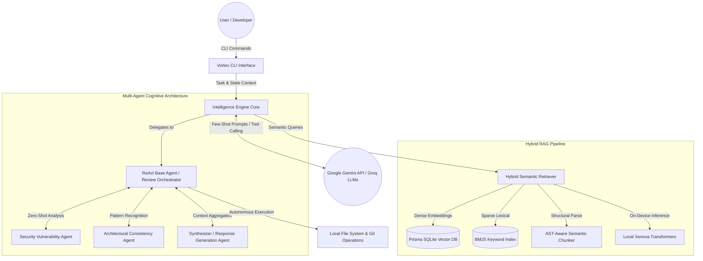
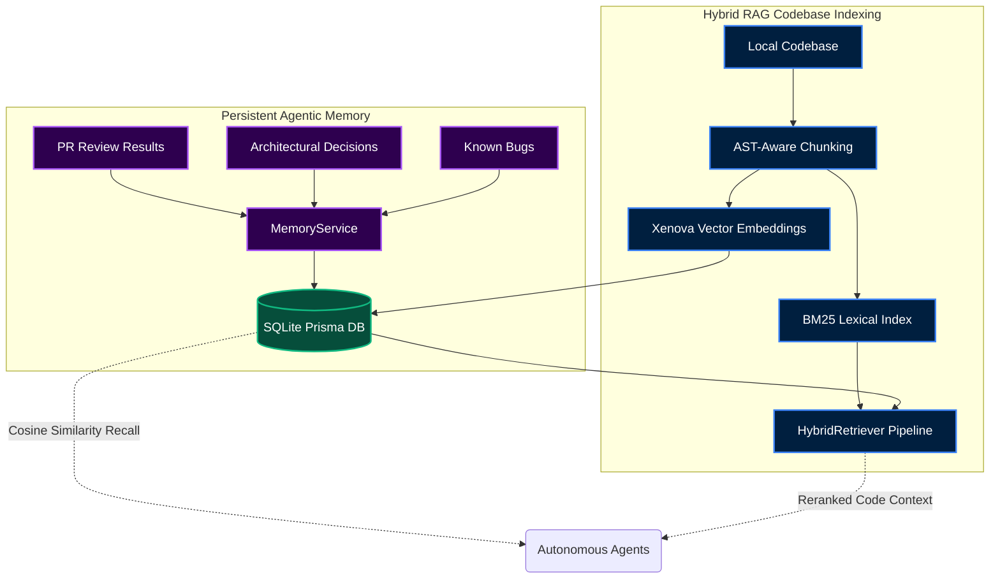

# Vortex - Developer Intelligence & PR Review Engine

## 1. Introduction
**Vortex** is an autonomous, AI-powered developer assistant and CLI tool that combines semantic code search, Git integration, and LLM-based intelligence. It provides contextual code reviews, deeply technical issue analysis, interactive semantic search, and an autonomous coding agent to help you solve tasks right in your terminal.

## 2. File Structure Explained
A quick look at the monorepo structure:
```text
vortex/
├── packages/
│   ├── cli/              # The command-line interface entry points
│   ├── engine/           # Core AI logic (IntelligenceEngine, Multi-Agent Orchestrator)
│   ├── db/               # Database layer handling Prisma and SQLite
│   ├── retrieval/        # Vector embeddings, BM25 indexing & Hybrid RAG search
│   ├── github/           # GitHub API client and PR/Issue utilities
│   ├── git/              # Git utilities and local repository operations
│   └── shared/           # Shared TypeScript types and configuration
└── services/
    └── worker/           # Background workers for asynchronous jobs (BullMQ)
```

## 3. Technologies Used
- **Core Languages & Runtime**: TypeScript & Node.js
- **Data Persistence**: SQLite with Prisma ORM
- **Large Language Models (LLMs)**: Google Gemini API (Flash/Pro) & Groq Fallbacks
- **Embeddings Pipeline**: Local Xenova Transformers (`@xenova/transformers`) for On-Device Dense Vector representations
- **Search Architecture**: Hybrid RAG (Retrieval-Augmented Generation) combining Dense Vector Similarity and Sparse BM25 Keyword Search
- **Cognitive Architecture**: ReAct (Reasoning and Acting) Agent Loops & Multi-Agent Orchestration
- **Code Intelligence**: AST-Aware Semantic Code Chunking
- **CLI Framework**: Commander.js
- **Monorepo Tooling**: TurboRepo & pnpm
- **Task Orchestration**: BullMQ for distributed, asynchronous offline intelligence processing

## 4. System Used (Cognitive Architecture)
Vortex runs on a sophisticated **Multi-Agent Cognitive Architecture** backed by **Hybrid RAG** (Retrieval-Augmented Generation).
Instead of passing code blindly to an LLM, Vortex uses specialized agents:
- **Security Agent**: Scans for vulnerabilities and insecure patterns.
- **Architecture Agent**: Checks code for design consistency against your repo's existing patterns.
- **Synthesizer Agent**: Combines outputs into an actionable, unified review.
- **Base Agent (ReAct Loop)**: An autonomous loop that can execute file system tools, read code, and run terminal commands to iteratively solve complex tasks.

## 5. Architectural Diagram



## 6. Architectural Flow
1. **User Request**: The user triggers a command (e.g., `vortex review --pr 42` or `vortex solve "fix the login bug"`).
2. **Context Retrieval**: The engine extracts semantic queries from the task/diff. The Hybrid RAG pipeline uses both exact keyword matching (BM25) and dense vector embeddings to fetch highly relevant code chunks from the local SQLite DB.
3. **Agent Delegation**: The Orchestrator spins up the necessary sub-agents, passing them the retrieved local context.
4. **Execution & Analysis**: 
   - For reviews, agents analyze security and architecture, passing their findings to the Synthesizer.
   - For the autonomous `solve` agent, it enters a ReAct (Reason + Act) loop, actively reading files, making code edits, and verifying its work locally until the task is complete.
5. **Output**: Beautifully formatted markdown, structural suggestions, or directly committed code fixes are delivered to the user.

## 7. Role of AI API
The external AI API (primarily **Google Gemini**) acts as the brain of the operation. While the embeddings and vector search happen locally on your machine for privacy and speed, the AI API is responsible for:
- **Reasoning**: Deciding which tool to use next in an autonomous agent loop.
- **Synthesis**: Formatting deeply technical reviews and understanding complex code logic.
- **Code Generation**: Writing the actual fixes, refactoring suggestions, and new features based on the context provided by the local RAG pipeline.

## 8. Installation and Setup Guide

### Installation
Once published to npm, you can install Vortex globally:
```bash
npm install -g vortex-cli
```

### Setting your AI API Key
Vortex requires an API key to communicate with the LLM (e.g., Google Gemini or Groq). You have three flexible ways to provide your keys:

**1. Global Configuration (Recommended)**
Create a `.vortexenv` file in your home directory (`~/.vortexenv`). This key will automatically be used in all your projects.
```env
GEMINI_API_KEY=your_gemini_key_here
GROQ_API_KEY=your_groq_key_here
```

**2. Local Project Override**
To use a specific key for a specific repository, place a `.env` file at the root of your project directory where you run Vortex.
```env
GEMINI_API_KEY=project_specific_gemini_key
GROQ_API_KEY=project_specific_groq_key
```

**3. Inline / Shell Profile**
You can also set it dynamically via your terminal or shell profile (`~/.bashrc` / `~/.zshrc`):
```bash
export GEMINI_API_KEY="your_gemini_key_here"
export GROQ_API_KEY="your_groq_key_here"
# Or run it inline:
GEMINI_API_KEY="your_key" vortex solve "add a button"
```

## 9. Features Supported (In Short)
- **`vortex init`**: Indexes your local repository and generates local vector embeddings.
- **`vortex solve <prompt>`**: Autonomous AI agent that explores your codebase, writes code, and executes terminal commands to solve your task. (Supports `--auto-approve` to bypass safety prompts).
- **`vortex solve-issue --id <id>`**: Seamlessly connects GitHub issues with the Autonomous Agent. Fetches the issue, runs RAG to find relevant local code, and automatically writes the fix.
- **`vortex review --pr <id>`**: Multi-agent PR review analyzing security, architecture, and logic.
- **`vortex search -q <query>`**: Semantic, natural language code search backed by AI explanations.
- **`vortex issue --id <id>`**: Analyzes GitHub issues and proposes step-by-step local code fixes.
- **`vortex graph`**: Automatically generates Mermaid dependency graphs of your files or entire project.
- **`vortex fix-nitbits`**: AI-powered auto-fixer for linting, formatting, and minor structural issues.

## 10. Real-world Examples

**Scenario 1: Refactoring Code Autonomously**
```bash
# Ask Vortex to understand the architecture and solve the task automatically
vortex solve "Refactor the authentication middleware to use JWT instead of sessions, making sure it aligns with the existing User model"
```

**Scenario 2: Pre-Merge Security & Architecture Review**
```bash
# Run a multi-agent review on your pull request before asking your human team
vortex review --pr 104 --deep
# Output: The Security Agent flags a data leak, the Architecture Agent suggests abstracting the API call, and the Synthesizer provides the exact diff to fix it.
```

**Scenario 3: Generating an Issue Implementation Plan**
```bash
vortex issue --id 45
# Output: Vortex reads issue #45, semantically searches your local repo, finds the exact 3 files responsible for the bug, and outputs a step-by-step implementation plan.
```

**Scenario 4: Fully Autonomously Solving a GitHub Issue**
```bash
vortex solve-issue --id 45
# Output: Fetches Issue #45, grabs local RAG context, and hands it directly to the ReAct agent which starts actively writing the code to fix the bug in your workspace.
```

## 11. Security & Safety Boundaries

Running autonomous agents on your local machine requires strict safety rails. Vortex includes:
- **Interactive Diff Approvals**: The `solve` command will pause and ask for your permission (Y/n) before running any terminal commands or overwriting files. You can bypass this in CI pipelines with the `--auto-approve` flag.
- **Rollback Backups**: Whenever the agent modifies a file, the original version is automatically backed up to `.vortex_backup/` to prevent data loss.
- **Command Blacklist**: Dangerous commands like `rm`, `sudo`, `chmod`, and `chown` are hardcoded to be instantly rejected if the agent attempts to run them.
- **Real-Time Visuals**: See what the agent is doing with inline `git diff` outputs as files are successfully edited during the execution loop.

## 12. Memory Architecture

Vortex utilizes a highly sophisticated, multi-layered memory architecture. It is split into two primary domains: **Persistent Agentic Memory** (for past experiences) and a **Hybrid RAG Pipeline** (for codebase context).



### 1. Persistent Agentic Memory (`MemoryService`)
This acts as the "episodic memory" for the AI agents, allowing them to learn from past mistakes and establish consistency across your project. Backed by a local SQLite database:
- **ReviewHistory**: Stores structured results of every PR review (verdicts, findings, summaries).
- **Semantic Memories**: General-purpose entries tagged as `architectural_decision`, `known_bug`, or `review_summary`.
- **Semantic Recall**: When a new review starts, Vortex encodes the current context and runs a cosine-similarity search against past memories. The agents can ask questions like, *"Have we flagged this specific anti-pattern in a previous PR?"*

### 2. Hybrid RAG Codebase Indexing (`HybridRetriever`)
This is the "working memory" used by `vortex solve` and `vortex issue` to understand your repository without overflowing the LLM context window.
- **AST-Aware Chunking**: Uses TypeScript AST (Abstract Syntax Tree) chunking to cleanly separate functions, classes, and interfaces.
- **Dense Vector Search (`VectorStore`)**: Uses local, on-device Xenova Transformers to generate semantic vector embeddings of your code.
- **Sparse Lexical Search (`BM25Index`)**: Maintains a classic BM25 keyword index to ensure high precision when searching for exact variable names or function signatures.
- **Cross-Encoder Reranking**: When the agent searches for context, it runs both Vector and BM25 searches simultaneously, then reranks the results to feed only the top, most relevant chunks into its context window.

## 13. Performance & Metrics

Vortex is engineered for speed and cost-efficiency, keeping the heavy lifting local to your machine:

- **Zero-Cost Indexing**: Generating embeddings for your repository runs entirely on-device via Xenova Transformers, meaning **no API costs** and **complete privacy**.
- **Lightning-Fast Search**: Executing a Hybrid RAG search (Dense Vectors + BM25) across your entire indexed codebase is highly optimized for instantaneous retrieval.
- **Token Efficiency**: By intelligently chunking code (AST-aware) and only sending the most relevant segments to the LLM, Vortex uses significantly fewer tokens compared to assistants that dump the entire codebase into the context window.
- **Rapid Analysis**: The complete Multi-Agent PR Review loop (Security, Architecture, and Synthesis) leverages fast APIs like Gemini Flash and Groq for quick feedback.
