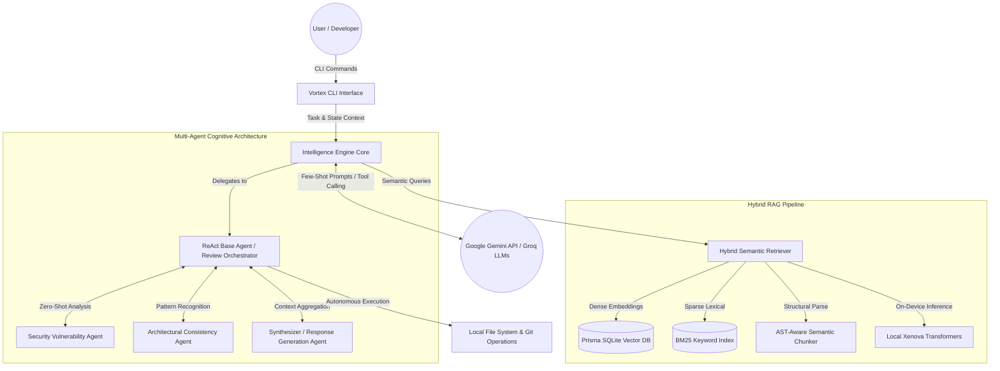

# Vortex - Developer Intelligence & PR Review Engine


**Vortex** is an autonomous, AI-powered developer assistant and CLI tool that combines semantic code search, Git integration, and LLM-based intelligence. It provides contextual code reviews, deeply technical issue analysis, interactive semantic search, and an autonomous coding agent to help you solve tasks right in your terminal.

---

## Quick Start

### Installation

Install Vortex globally via npm:
```bash
npm i -g @vortex-ai/cli
```

### Configuration

Vortex requires an API key for its LLM engine (e.g., Google Gemini or Groq). You can easily configure your keys globally using the `config` command:

```bash
# Add your Gemini API key
vortex config set gemini "your_gemini_key_here"

# Add your Groq API key
vortex config set groq "your_groq_key_here"

# Add your OpenRouter API key (fallback provider)
vortex config set openrouter "your_openrouter_key_here"

# View your active configuration
vortex config list
```

You can also use project-specific `.env` files or inline environment variables.

### Your First Commands

```bash
# 1. Initialize the local vector and BM25 indexes for your repository
vortex init

# 2. Ask the autonomous agent to solve a task
vortex solve "Refactor the authentication middleware to use JWT"

# 3. Perform a multi-agent review on a pull request
vortex review --pr 42
```

---

## Core Features

- **`vortex solve <prompt>`**: Autonomous AI agent that explores your codebase, writes code, and executes terminal commands to solve your task.
- **`vortex solve-issue --id <id>`**: Seamlessly connects GitHub issues with the Autonomous Agent. Fetches the issue, runs RAG to find relevant local code, and automatically writes the fix.
- **`vortex review --pr <id>`**: Multi-agent PR review analyzing security, architecture, and logic.
- **`vortex search -q <query>`**: Semantic, natural language code search backed by AI explanations.
- **`vortex issue --id <id>`**: Analyzes GitHub issues and proposes step-by-step local code fixes.
- **`vortex graph`**: Automatically generates Mermaid dependency graphs of your files or entire project.

*Note: The CLI is deeply optimized for performance. We recently pruned obsolete commands to focus purely on autonomous intelligence.*


*Note: Most read-only analysis commands automatically cache LLM requests to speed up subsequent runs and save API costs.*

---

## Real-world Examples

**Scenario 1: Refactoring Code Autonomously**
```bash
vortex solve "Refactor the authentication middleware to use JWT instead of sessions, making sure it aligns with the existing User model"
```

**Scenario 2: Pre-Merge Security & Architecture Review**
```bash
vortex review --pr 104 --deep
# Output: The Security Agent flags a data leak, the Architecture Agent suggests abstracting the API call, and the Synthesizer provides the exact diff to fix it.
```

**Scenario 3: Fully Autonomously Solving a GitHub Issue**
```bash
vortex solve-issue --id 45
# Output: Fetches Issue #45, grabs local RAG context, and hands it directly to the ReAct agent which actively writes the code to fix the bug.
```

---

## Architecture Overview

Vortex runs on a sophisticated **Multi-Agent Cognitive Architecture** backed by **Hybrid RAG** (Retrieval-Augmented Generation).

### Multi-Agent System
Instead of passing code blindly to an LLM, Vortex uses specialized agents:
- **Security Agent**: Scans for vulnerabilities and insecure patterns.
- **Architecture Agent**: Checks code for design consistency against your repo's existing patterns.
- **Synthesizer Agent**: Combines outputs into an actionable, unified review.
- **Base Agent (ReAct Loop)**: An autonomous loop that can execute file system tools, read code, search the web for missing library schemas, and run terminal commands to iteratively solve tasks.

### Memory & Retrieval
Vortex utilizes a multi-layered memory architecture to maintain context without exceeding token limits or sacrificing privacy.

1. **Persistent Agentic Memory (`MemoryService`)**: Acts as episodic memory. Stores review history, architectural decisions, and known bugs in a local SQLite database for cross-PR consistency.
2. **Hybrid RAG Indexing (`HybridRetriever`)**: Uses AST-aware chunking, on-device Xenova Transformer dense vector embeddings, and sparse lexical BM25 indexing. Cross-encoder reranking ensures only the most relevant context is fed to the LLM.



---

## Security & Safety Boundaries

Running autonomous agents on your local machine requires strict safety rails. Vortex includes:
- **Interactive Diff Approvals**: The `solve` command will pause and ask for your permission (Y/n) before running any terminal commands or overwriting files. You can bypass this in CI pipelines with the `--auto-approve` flag.
- **Rollback Backups**: Whenever the agent modifies a file, the original version is automatically backed up to `.vortex_backup/` to prevent data loss.
- **Command Blacklist**: Dangerous commands like `rm`, `sudo`, `chmod`, and `chown` are instantly rejected if the agent attempts to run them.
- **Real-Time Visuals**: See what the agent is doing with inline `git diff` outputs as files are successfully edited.

---

## Performance & Privacy

Vortex is engineered for speed and cost-efficiency, keeping the heavy lifting local to your machine:
- **Zero-Cost Indexing**: Generating embeddings for your repository runs entirely on-device via Xenova Transformers, meaning **no API costs** and **complete privacy**.
- **Token Efficiency**: By intelligently chunking code (AST-aware) and only sending the most relevant segments to the LLM, Vortex uses significantly fewer tokens.

---

## Contributing

We welcome contributions! Please see our [Contributing Guide](CONTRIBUTING.md) for details on how to set up the development environment and submit pull requests.

### Development Setup
```bash
git clone https://github.com/DivyanshuVortex/vortex.git
cd vortex
npm install
npm run build
```

## License

This project is licensed under the MIT License - see the [LICENSE](LICENSE) file for details.
